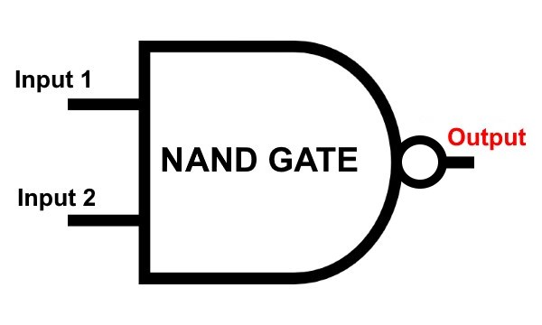

# Contrua um computador Moderno

Construa um computador moderno a partir dos primeiros princípios: do Nand ao Tetris

------

# Build a Modern Computer

Build a Modern Computer from First Principles: From Nand to Tetris

------

https://www.coursera.org/learn/build-a-computer

